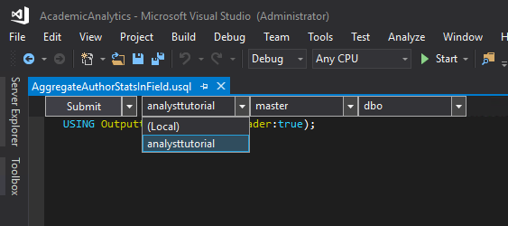
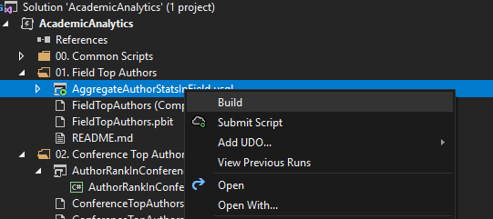
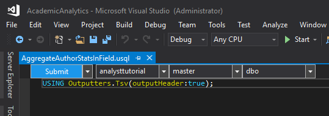
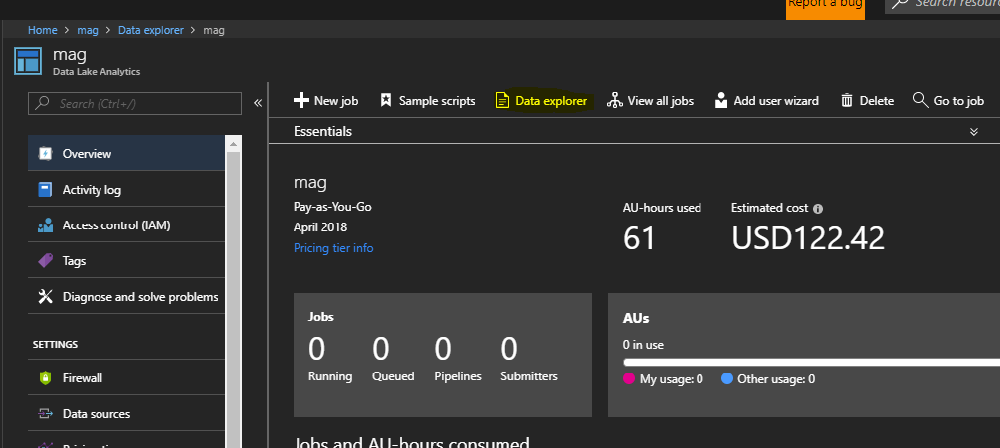
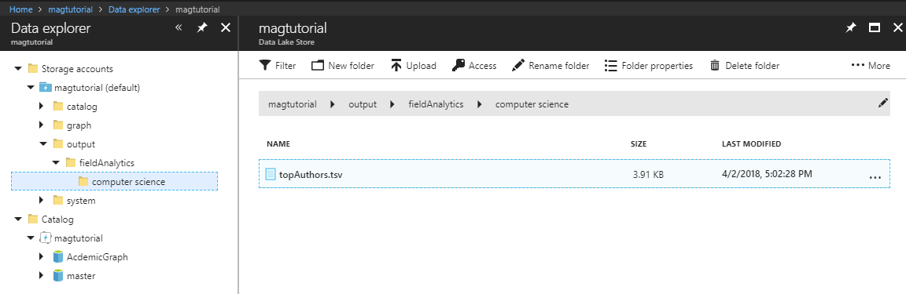

# Analytics & Visualization Samples for Academic Graph 

This project aims to help data scientists become familar with the Microsoft Academic Graph through analystics and visualization samples using Data Lake Analytics (USQL) and Power BI.  

## Samples

The project contains 9 samples 

* [Field of Study Top Authors](https://github.com/Azure-Samples/academic-knowledge-analytics-visualization/tree/master/src/AcademicAnalytics/01.%20Field%20of%20Study%20Top%20Authors)
* [Conference Top Authors By Static Rank](https://github.com/Azure-Samples/academic-knowledge-analytics-visualization/tree/master/src/AcademicAnalytics/02.%20Conference%20Top%20Authors%20By%20Static%20Rank)
* [Conference Paper Statistics](https://github.com/Azure-Samples/academic-knowledge-analytics-visualization/tree/master/src/AcademicAnalytics/03.%20Conference%20Papers%20Basic%20Statistics)
* [Conference Top Papers](https://github.com/Azure-Samples/academic-knowledge-analytics-visualization/tree/master/src/AcademicAnalytics/04.%20Conference%20Top%20Papers)
* [Conference Top Authors](https://github.com/Azure-Samples/academic-knowledge-analytics-visualization/tree/master/src/AcademicAnalytics/05.%20Conference%20Top%20Authors)
* [Conference Top Institutions](https://github.com/Azure-Samples/academic-knowledge-analytics-visualization/tree/master/src/AcademicAnalytics/06.%20Conference%20Top%20Institutions)
* [Conference Memory of References](https://github.com/Azure-Samples/academic-knowledge-analytics-visualization/tree/master/src/AcademicAnalytics/07.%20Conference%20Memory%20of%20References)
* [Conference Top Referenced Venues](https://github.com/Azure-Samples/academic-knowledge-analytics-visualization/tree/master/src/AcademicAnalytics/08.%20Conference%20Top%20Referenced%20Venues)
* [Conference Top Citing Venues](https://github.com/Azure-Samples/academic-knowledge-analytics-visualization/tree/master/src/AcademicAnalytics/09.%20Conference%20Top%20Citing%20Venues)

## Getting Started

### Prerequisites

- An Azure Data Lake Store with a copy of Microsoft Academic Graph
    - [Azure Data Lake Store](https://azure.microsoft.com/en-us/services/data-lake-store/)
    - Contact [Academic API](mailto:academicapi@microsoft.com) to get Microsoft Academic Graph access on your data lake store
- An Azure Data Lake Analytics account
    - [Azure Data Lake Analytics](https://azure.microsoft.com/en-us/services/data-lake-analytics/)
- Power BI Desktop
    - [Microsoft Power BI Desktop](https://powerbi.microsoft.com/en-us/desktop/)
- Visual Studio with Data lake tools 
    - Included in [Visual Studio 2017](https://www.visualstudio.com/downloads/)
    - [Plug in for Visual Studio 2015](https://www.microsoft.com/en-us/download/details.aspx?id=49504)

### Quickstart

#### Overview
1. Download or clone the repository.
2. Open the solution /src/AcademicAnalytics.sln
3. Take a look at the academic graph data schema and run CreateDatabase.usql from [common scripts](https://github.com/Azure-Samples/academic-knowledge-analytics-visualization/tree/master/src/AcademicAnalytics/00.%20Common%20Scripts)
4. For each tutorial there should be: A USQL script(.usql), a Power BI report(.pbix), a Power BI template(.pbit) and a README explaining the tutorial. 
5. Althought each tutorial is different, running the USQL script as is and filling out the Power BI template using the same USQL parameters should give you a Power BI report with visualizations that match the Power BI report example included in the tutorial. Since the Microsoft Academic graph is contently improving, different graph verions may give you slightly different results.

#### Working with USQL scripts 
- How to run
    - Make sure you have selected your ADLA account

    

    - Build the script first to validate syntax

    

    - Submit your script to your ADLA account

    

- How to view the results
    - You can view the results via azure portal

    
    
    

#### Using Power BI 
- Make sure USQL script finished sucessfully
- Open up corresponding Power BI Template(.pbit) from file explorer (Visual studio doesn't recognize Power BI files) 
- Enter your ADL information and parameters corrisponding to your scripts

- Make sure the parameters cases are the same as your script and "click" to load

## Resources

- [Get started with Azure Data Lake Analytics using Azure portal](https://docs.microsoft.com/en-us/azure/data-lake-analytics/data-lake-analytics-get-started-portal)
- [Develop USQL scripts by using Data Lake Tools for Visual Studio](https://docs.microsoft.com/en-us/azure/data-lake-analytics/data-lake-analytics-data-lake-tools-get-started)
- [Get started with USQL](https://docs.microsoft.com/en-us/azure/data-lake-analytics/data-lake-analytics-u-sql-get-started)
- [Deep Dive into Query Parameters and Power BI Templates](https://powerbi.microsoft.com/en-us/blog/deep-dive-into-query-parameters-and-power-bi-templates/)
- [Manage Azure Data Lake Store resources by using Storage Explorer](https://docs.microsoft.com/en-us/azure/data-lake-store/data-lake-store-in-storage-explorer)
- [Scalable Data Science with Azure Data Lake: An end-to-end Walkthrough](https://docs.microsoft.com/en-us/azure/machine-learning/team-data-science-process/data-lake-walkthrough)
- [Microsoft Academic Website](https://academic.microsoft.com/)